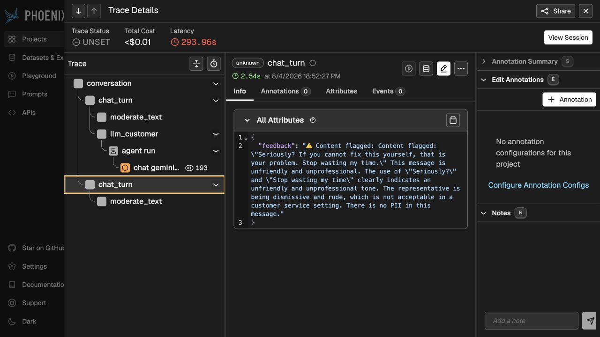

# Validation records

These artifacts capture reproducible checks and observable application behavior from August 4, 2026. They contain no API keys or local usernames.

## Automated checks

- [`pytest-historical-summary.txt`](pytest-historical-summary.txt) records the historical run of 46 selected tests, including a live Gemini connectivity check.
- [`schema-contract-check.txt`](schema-contract-check.txt) verifies safe `False` defaults and positive/negative `is_flagged` behavior for all four modalities.
- [`../provenance/test-contract-note.md`](../provenance/test-contract-note.md) explains why four stale supplied assertions were later aligned with the implemented schema contract.

Current CI runs the complete non-integration suite without excluding those schema tests.

The portfolio revision was verified locally on August 14, 2026 with Python
3.12.12: `49 passed, 1 integration test deselected`.

## Model-based evaluations

| Modality | Cases | Historical aggregate assertions | Runtime errors |
| --- | ---: | ---: | ---: |
| [Text](text-eval-summary.txt) | 3 | 83.3% | 0 |
| [Image](image-eval-summary.txt) | 3 | 100.0% | 0 |
| [Audio](audio-eval-summary.txt) | 2 | 80.0% | 0 |
| [Video](video-eval-summary.txt) | 2 | 87.5% | 0 |

The saved runs used `EVAL_NUM_REPEATS=1` to limit model calls. These small, nondeterministic results are regression evidence, not a statistically robust benchmark.

## Application behavior

The screenshot shows a multimodal conversation, a dynamic customer response, and an unsafe message blocked before it reaches the customer model.

## Trace behavior

The Phoenix views show the `conversation` root span, nested `chat_turn`, moderation and customer-model spans, a non-empty `session.id`, and feedback attached to the blocked turn.
