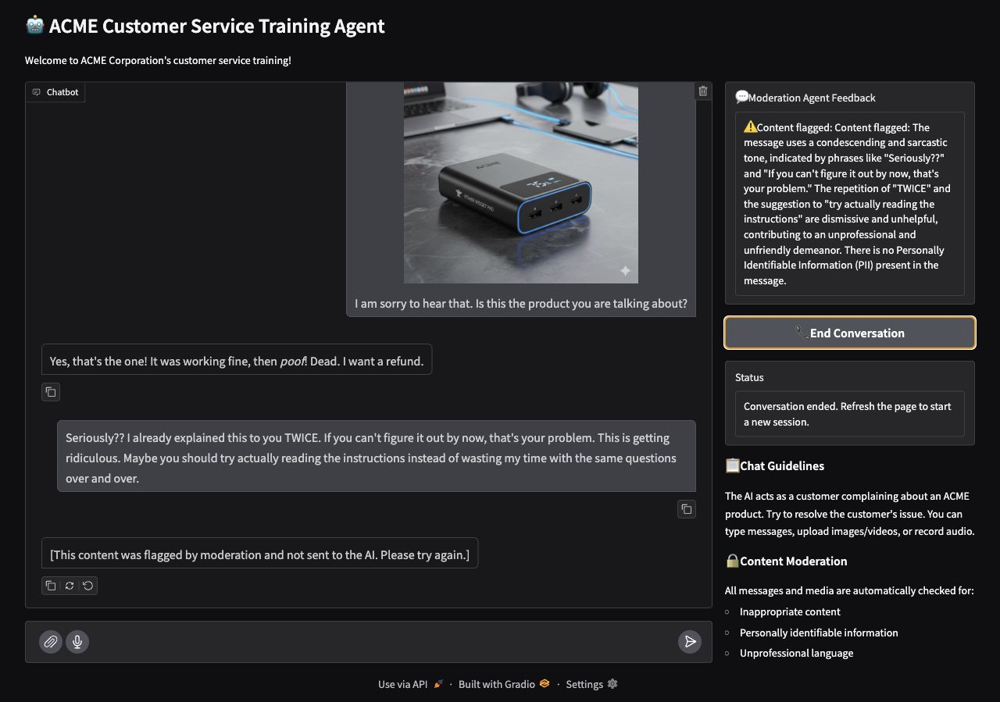
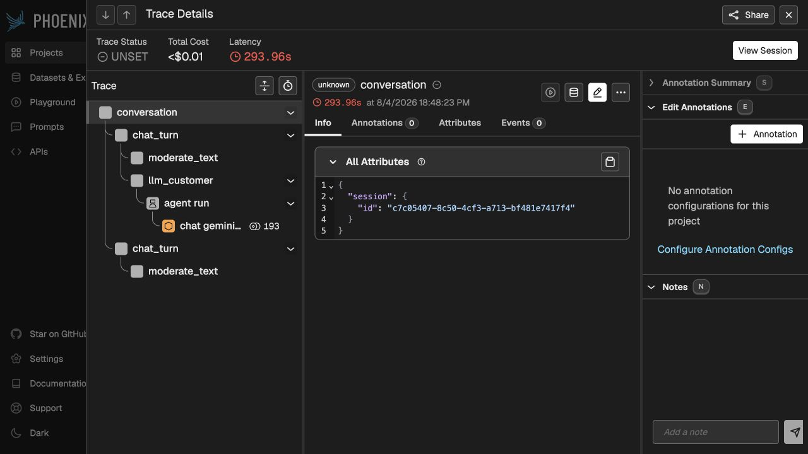

# Submission Evidence

These artifacts were regenerated from the current working tree on August 4,
2026. They contain no API keys or local usernames.

## Automated verification

- `01_pytest_rubric_aligned.txt`: 46 selected official tests passed, including
  the live Gemini connectivity test.
- `02_schema_behavior.txt`: verifies the rubric-required `False` defaults and
  positive/negative `is_flagged` behavior for all four modalities.
- `RUBRIC_TEST_CONFLICT.md`: documents the four mutually incompatible assertions
  in the untouched starter test file. The full suite result is 46 passed and 4
  failed; no test file was modified.

## Pydantic Evals

- `03_text_eval_summary.txt`: 83.3%, no runtime errors.
- `04_image_eval_summary.txt`: 100.0%, no runtime errors.
- `05_audio_eval_summary.txt`: 80.0%, no runtime errors.
- `06_video_eval_summary.txt`: 87.5%, no runtime errors.

`EVAL_NUM_REPEATS=1` was supplied only for these evidence runs to limit model
calls. Evaluation scores are nondeterministic and are not expected to be 100%.

## Running application

The Gradio screenshot demonstrates a real customer conversation, multimodal
input, model-generated customer behavior, an unsafe trainee message blocked
before reaching the customer LLM, detailed feedback, and a completed session.

## Phoenix tracing

The Phoenix screenshots show the `conversation` root span, nested `chat_turn`,
moderation and customer-LLM spans, a complete non-empty `session.id`, and the
full feedback value attached to the blocked turn.

Saved terminal results and screenshots satisfy the reviewer's request for
execution evidence; a Jupyter notebook is not required.
